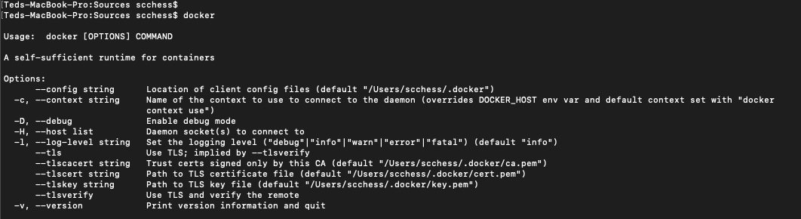

## Summary

Command-line tool that analyses ONT alignments (.bam) to report quality control statistics.

## Installation

This program requires the following dependencies:

* [SAMTool](https://samtool.org/)
* [Pysam](https://pysam.readthedocs.io/en/latest/api.html)
* [bedtools](https://bedtools.readthedocs.io/en/latest/)

The dependencies can be installed manually, however, an alternative is `docker`. Building this program on
docker is easy and straightforward. Docker will automatically work out the dependencies.

* Download docker from https://docs.docker.com/get-docker
* Start a terminal and type `docker`.

If your docker installation is successful, the `docker` command will show the following:

Run the following to download the source code of this program and build this program on Docker. Please note docker will
install the dependencies for you.

> :warning: Your docker may need `sudo` to run

    git clone https://github.com/scchess/Mana.git
    cd Mana
    docker build -t mana .

Docker has now installed the program for you. Please check the next section on how to use Docker.

## Quick Start

Let's download a sample alignment file:

    wget https://www.dropbox.com/s/25bvchax1wgvf5m/cDNA_UnMod_37C_NEBT7_BaseGfpmRNA_1strun_allpassedreads_sorted.bam?dl=1
    mv cDNA_UnMod_37C_NEBT7_BaseGfpmRNA_1strun_allpassedreads_sorted.bam?dl=1 sample.bam

Let's use samtools to check the reference this BAM file was aligned to:

    samtools view sample.bam 

Use `docker` to show command-line usage:

    docker run mana python3 mana.py

Run an mRNA analysis:

    docker run -v ${PWD}:/src -i -t mana python3 mana.py --mrna -b sample.bam -f plasmid_gfp.fasta -m1 432 -m2 1635
    cat outputs/mrna_results.txt

Generally, to run Mana with `docker`:

    docker run -v ${PWD}:/src -i -t mana <YOUR_USAGE>

Simply replace `<YOUR_USAGE>` with your command line usage. For example, to print the help page:

    docker run -v ${PWD}:/src -i -t mana python3 mana.py -h

where `<YOUR_USAGE>` is `python3 mana.py -h` in this example.